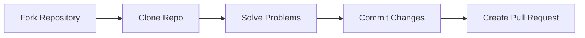

<div align="center">


<br/>


<br/>


<br/><br/>

<p align="center">
  
  
  
  
  
</p>

<br/>


</div>

---

# 🌟 About This Repository

<div align="center">


</div>

> *“Consistency beats intensity.”* 🚀

This repository documents my journey of mastering:

- 🧠 Data Structures
- ⚡ Algorithms
- 💻 Problem Solving
- 🚀 Competitive Programming
- 🎯 Coding Interview Preparation

Every solution here represents:
- learning,
- discipline,
- consistency,
- and continuous improvement.

The goal is not just solving problems —
but developing the mindset required to become a better software engineer.

---

# ⚡ Tech Stack

<div align="center">

<table>
<tr>
<td align="center" width="180">
<br/>
<b>Java</b>
</td>

<td align="center" width="180">
<br/>
<b>Git</b>
</td>

<td align="center" width="180">
<br/>
<b>GitHub</b>
</td>

<td align="center" width="180">
<br/>
<b>IntelliJ IDEA</b>
</td>
</tr>
</table>

</div>

---

# 📊 GitHub Analytics

<div align="center">


<br/><br/>


</div>

---

# 🧠 DSA Topics Covered

<div align="center">


</div>

<div align="center">

| 📚 Topic | 🚀 Concepts |
|---|---|
| 📘 Arrays | Sliding Window, Prefix Sum, Kadane |
| 🌳 Trees | DFS, BFS, BST, Traversals |
| 🔗 Linked List | Fast & Slow Pointer, DLL |
| 📚 Stack & Queue | Monotonic Stack, Queue Problems |
| ⚡ Dynamic Programming | Memoization, Tabulation |
| 🔍 Searching & Sorting | Binary Search, Merge Sort |
| 🧮 Bit Manipulation | XOR, Bitmasking, Set Bits |
| 🧠 Graphs | BFS, DFS, Shortest Path |
| 💡 Recursion | Backtracking, Divide & Conquer |

</div>

---

# 📂 Repository Structure

```bash
Problem-Name/
 ├── Solution.java
 ├── README.md
```

### 🚀 Example Problems

```bash
1-two-sum/
1056-capacity-to-ship-packages-within-d-days/
128-longest-consecutive-sequence/
```

---

# 🎯 Mission

<div align="center">


</div>

<div align="center">

| 🎯 Goals |
|---|
| ✅ Master Data Structures & Algorithms |
| ✅ Improve Problem Solving Skills |
| ✅ Build Interview Confidence |
| ✅ Write Clean & Optimized Java Code |
| ✅ Maintain Daily Consistency |
| ✅ Grow as a Software Engineer |

</div>

---

# 🔥 Current Focus

<div align="center">

```diff
+ Data Structures
+ Algorithms
+ Problem Solving
+ Competitive Programming
+ Interview Preparation
+ Consistency & Growth
```

</div>

---

# 💡 Why This Repository Exists

This repository helps me:

🚀 Track my coding journey publicly  
🧠 Improve analytical thinking  
🔥 Stay disciplined every day  
💻 Build strong coding habits  
📚 Create an organized DSA archive  
🎯 Prepare for software engineering interviews  

---

# 🌌 Contribution Workflow

<div align="center">



</div>

---

# 🤝 Contributions

<div align="center">


</div>

Contributions, suggestions, and improvements are always welcome 🚀

If you'd like to contribute:

```bash
Fork → Clone → Solve → Commit → Pull Request
```

---

# 📬 Connect With Me

<div align="center">

<a href="https://github.com/Vatsasarthak">

</a>

<br/><br/>


</div>

---

<div align="center">

## ⭐ If you like this repository, consider giving it a star ⭐


<br/><br/>


<br/><br/>

# 🚀 Keep Learning • Keep Building • Keep Growing


</div>
